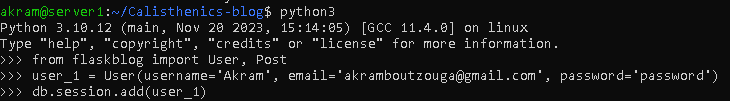

# Calisthenics-blog - Kingdom Calisthenics


## Project Structure
```bash
CalisthenicsBlog/
│
├── __init__.py
├── forms.py
├── models.py
├── routes.py
├── templates/
│   ├── layout.html
│   ├── home.html
│   ├── about.html
│   ├── register.html
│   └── login.html
└── static/
    ├── css/
    ├── js/
    └── images/
```	

### Technologies Used:
- HTML CSS And Bootstrap 5
- Flask Framework
- ORM SqlAlchemy Database

### Features
- Registration and Login System
- CRUD Blogs
- Ai writer 


### Concepts
- Template Inheritance
- 


### Fixing Errors

#### Performing Operations on database
- If you wanna test your database, by adding a user and you're facing this error when :

- Try Performing the add user operation within the application context:


The with app.app_context(): line ensures that the operations within this block have access to the current application context, which is necessary for database operations.
This approach will successfully add and commit the user_1 to your database within the required application context.